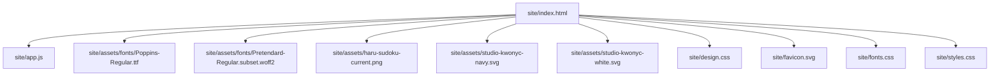

# 홈페이지 파일 연결

네이티브 codegraph 도구·CLI를 찾지 못해 HTML 자산 참조를 읽는 대체 그래프를 생성했다. JavaScript의 전체 호출 관계나 브라우저 실행 검증은 아니다.

```mermaid
graph TD
  index["site/index.html"]
  index --> asset0["site/app.js"]
  index --> asset1["site/assets/fonts/Poppins-Regular.ttf"]
  index --> asset2["site/assets/fonts/Pretendard-Regular.subset.woff2"]
  index --> asset3["site/assets/haru-sudoku-current.png"]
  index --> asset4["site/assets/studio-kwonyc-navy.svg"]
  index --> asset5["site/assets/studio-kwonyc-white.svg"]
  index --> asset6["site/design.css"]
  index --> asset7["site/favicon.svg"]
  index --> asset8["site/fonts.css"]
  index --> asset9["site/styles.css"]
```

콘텐츠와 링크는 site/index.html, 반응형은 site/styles.css, 메뉴·현재 섹션 표시는 site/app.js에서 수정한다.
